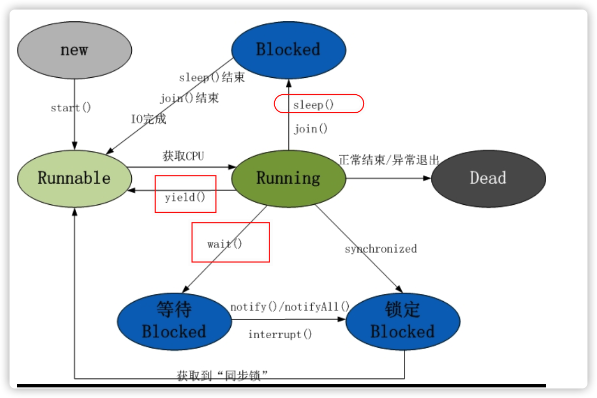

# 基础

- 面向对象的特征
  - 封装，继承，多态
- final, finally, finalize 的区别
  - https://www.cnblogs.com/ktao/p/8586966.html
- int 和 Integer 有什么区别
  - int 是非封装类，
  - Integer是封装类，能区别0和null
- 重载和重写的区别
  - 
- 抽象类和接口有什么区别
  - 
- 说说反射的用途及实现
  - 
- 说说自定义注解的场景及实现
  - 
- HTTP 请求的 GET 与 POST 方式的区别
  - 
- session 与 cookie 区别
- session 分布式处理
- JDBC 流程
- MVC 设计思想
- equals 与 == 的区别

## Java 中 volatile 关键字的最全总结

https://mp.weixin.qq.com/s/neDCzdVoXiger9D1hXBcag

# 多线程

### synchronized基本规则**

第一条: 当一个线程访问“某对象”的“synchronized方法”或者“synchronized代码块”时，其他线程对“该对象”的该“synchronized方法”或者“synchronized代码块”的访问将被阻塞。
第二条: 当一个线程访问“某对象”的“synchronized方法”或者“synchronized代码块”时，其他线程仍然可以访问“该对象”的非同步代码块。
第三条: 当一个线程访问“某对象”的“synchronized方法”或者“synchronized代码块”时，其他线程对“该对象”的其他的“synchronized方法”或者“synchronized代码块”的访问将被阻塞。

### **实例锁 和 全局锁**

**实例锁** -- 锁在某一个实例对象上。如果该类是单例，那么该锁也具有全局锁的概念。
        实例锁对应的就是synchronized关键字。
**全局锁** -- 该锁针对的是类，无论实例多少个对象，那么线程都共享该锁。
        全局锁对应的就是static synchronized（或者是锁在该类的class或者classloader对象上）。

### **yield() 与 wait()的比较**

(01) wait()是让线程由“运行状态”进入到“等待(阻塞)状态”，而不yield()是让线程由“运行状态”进入到“就绪状态”。
(02) wait()是会线程释放它所持有对象的同步锁，而yield()方法不会释放锁。

### **sleep() 与 wait()的比较**

wait()的作用是让当前线程由“运行状态”进入“等待(阻塞)状态”的同时，也会释放同步锁。而sleep()的作用是也是让当前线程由“运行状态”进入到“休眠(阻塞)状态”。
wait()会释放对象的同步锁，而sleep()则不会释放锁

### **互斥锁ReentrantLock**

**公平锁**

