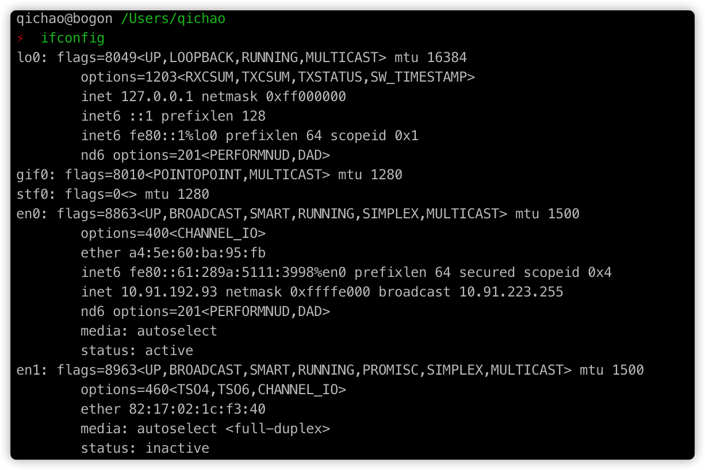
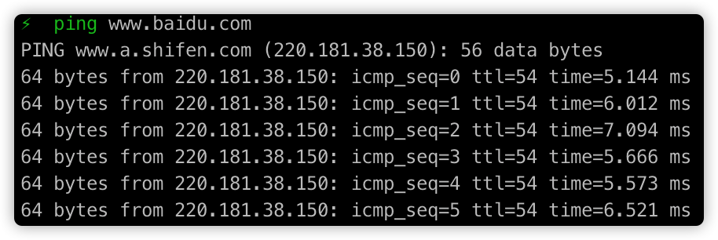
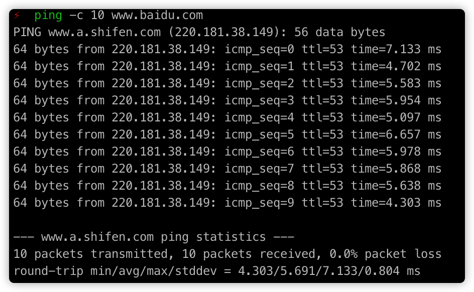

# ifconfig

查看网卡信息

# Ping

常规使用

-c 指定包个数

-W 指定最长等待时间

# traceroute

traceroute www.baidu.com

Traceroute能够显示到达目的地址所需的跳数、经过的路由器的IP地址、延时、丢包情况等信息。第一跳为10.91.192.1，第二跳为172.16.253.254，第三跳为36.112.24.1每条记录输出3个延时结果，说明源地址每次默认发送三个数据包；在7条记录只有1个延时结果，说明源地址只收到了1个ICMP超时通知消息